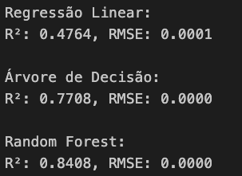
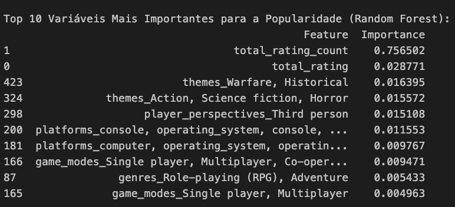

# Projeto de IA
Professor Dr. Ivan Carlos Alcântara de Oliveira

## Uma Análise dos Fatores que Influenciam a Popularidade de um Jogo
Integrantes: 
- Laura C. Balbachan dos Santos | 10390823
- Paulo Sonzzini Ribeiro de Souza | 10322918
- Tiago Caspirro Cardoso | 10390562

--- 

## Descrição do Projeto

Este projeto tem como objetivo desenvolver um modelo preditivo capaz de estimar a popularidade de novos videogames com base em seus atributos. Para isso, utilizamos dados da **API do IGDB**, uma base de dados abrangente sobre a indústria de jogos.

A análise inclui os seguintes passos:
1. **Coleta de Dados:** Extração automatizada de informações da API do IGDB.
2. **Análise Exploratória:** Identificação de correlações, análise de distribuição e detecção de outliers.
3. **Preparação dos Dados:** Limpeza, transformação e seleção das variáveis mais relevantes.
4. **Modelagem:** Desenvolvimento e validação de um modelo preditivo para estimar a popularidade de novos jogos.

---

## Justificativa

A indústria de jogos é uma das mais lucrativas no setor de entretenimento. O uso de métricas como "hype" e "popularidade" oferece uma oportunidade única para analisar fatores que impactam o sucesso de um jogo. Este projeto busca fornecer insights que podem ser usados por desenvolvedores e publicadores de jogos para entender melhor o mercado e otimizar seus recursos.

---

## Ferramentas e Tecnologias

- **Python** para manipulação de dados e modelagem.
- **Excel** para organização inicial dos dados.
- **API do IGDB** para coleta automatizada de informações.
- Bibliotecas utilizadas:
  - Pandas
  - NumPy
  - Matplotlib/Seaborn
  - Scikit-learn

---

## Resultados
Inicialmente, foi utilizado um dataset contendo 500 jogos, mas os resultados dos modelos de previsão de popularidade, como Regressão Linear, Árvore de Decisão e Random Forest, não apresentaram um desempenho satisfatório (com R² abaixo de 0.4 e RMSE elevados), o que indicou que a amostra de dados precisava ser ampliada para obter insights mais precisos. Com o aumento do dataset para 1000 jogos, combinando dois arquivos _.xlsx_ cujos dados foram extraídos da API do IGDB, houve uma melhora significativa nos resultados, sendo o modelo Random Forest o mais eficiente, com o melhor R² (0.8394) e o menor RMSE. 

A análise das importâncias das variáveis no modelo Random Forest revelou os atributos que mais influenciam a popularidade dos jogos, fornecendo informações valiosas sobre os fatores determinantes desse fenômeno. Esses resultados evidenciam que a quantidade e a qualidade dos dados são fundamentais para aprimorar a precisão dos modelos preditivos, além de destacar a importância da análise das variáveis para interpretar os resultados dos modelos.

Com essa pesquisa, chegamos a conclusão que, com os dados selecionados para a atividade, é possível entender que as variáveis que mais se relacionam com a popularidade de um jogo são:

